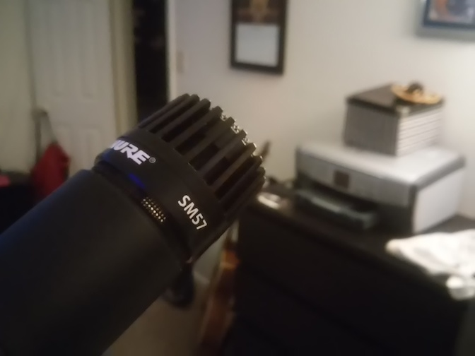

We are knee deep into recording our 4th album, folks. Making an album is an amazing and frustrating process. And it's a nice excuse to buy a new piece of musical gear. I give you the SM57 from Shure, gentlepeople!

===

If you are familiar with microphones, I'm sure you're no stranger to this mic. It's pretty notorious and has been used on recordings across all kinds of different genres. The SM57 is mainly a dynamic instrument mic but can be applied for vocal recordings as well, which is a reason I decided to nab one. My old Behringer mic sounded a little harsh to my ears and I've struggled in the past with getting a good vocal take out of it.

I'm trying to take a disciplined approach with recording the 4th album. I didn't have much of a method with previous works. It was more of an unfocused mad dash, where I would get swept up by inspiration, spend 16 hours straight sitting at a laptop recording my ideas, then not touch the song again for a year or more until it was released. I wasn't motivated if I wasn't in a creative mood. Sometimes months would go by between recordings. This resulted in songs sounding completely different from one another in terms of technique, atmosphere, and style. I'm not one to expect every song to sound the same, and in fact I enjoy albums that explore different genres and emotions, but with my old way of recording it didn't even sound like the same band from one song to the next. There could be two or three years between the first and last song on an album and my singing voice, guitar playing, and lyrics had considerably changed in the interim.

With this album, I'm focusing on vibe and color. I desire a cohesive vision where all the songs sound like they come from the same sonic universe. I'm actually sitting down and thinking about what I want to write before I write it, as opposed to when I was younger and my writing technique amounted to "well, that's a cool riff, I guess it's a song."

I tried a similar methodical approach on our previous album, [The Cat Agenda](https://gravityfreesummer.bandcamp.com/album/the-cat-agenda), but it was more extreme. I made numerous passes at alternate takes and mixes for that album, and although I like how it all turned out, it was hard work. For this new album I'm taking the middle road; I'm not being lazy and recording only one take with lyrics written in 5 minutes, but I'm also not recording a guitar riff over and over 50 times. Work steadfast. Make progress. Explore and grow. Be uncomfortable. Confuse yourself. Try more. Don't settle for the first idea. Keep working.

Being conscious of what I'm meaning to express and effectively communicating what I'm feeling is challenging yet rewarding. By recording more methodically, layering a solid foundation for all the songs at the same time and building it piece by piece in unison, it's starting to tie together.

**-h**
