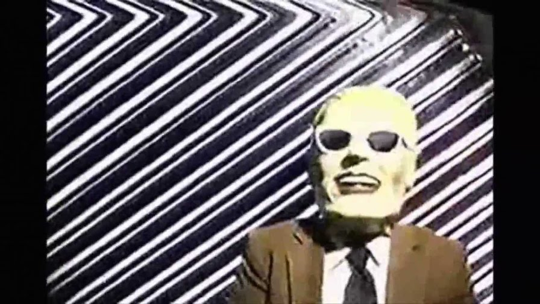

Last week I recorded vocal takes for a couple of songs. Since I don't have luxuries like a vocal booth, I usually set the mic up wherever in my bedroom, press the record button, and hope for the best. With my newest recordings I tried something a little different.

===

I decided to try recording in my closet. It felt a little cramped but luckily I'm not claustrophobic. Having an isolated space allowed me to get more into the singing mood, and recording in the closet shut out sounds of the outside world. This is usually a struggle while recording vocals in a non-professional environment--I have to compete with all kinds of noise: planes flying overhead, lawnmowers, children playing outside, etc. Although it wasn't perfect, my vocal takes sounded more immediate and clear.

It felt kind of funny, being in a tiny, dark room, filled with wires, computers, and recording weird sounds. Besides the obvious ["trapped in the closet"](http://southpark-zone.blogspot.com/2008/01/s9-trapped-in-closet.html) jokes, I felt like I was the guy in the Max Headroom incident. From [wikipedia](https://en.wikipedia.org/wiki/Max_Headroom_broadcast_signal_intrusion):
> The Max Headroom broadcast signal intrusion was a television signal hijacking that occurred in Chicago, Illinois, United States on the evening of November 22, 1987. It is an example of what is known in the television business as broadcast signal intrusion. The intruder was successful in interrupting two broadcast television stations within the course of three hours. Neither the hijacker nor any known accomplices have ever been found, caught or identified, which leaves the incident unsolved.

All that was missing was me wearing a mask and beaming my creation to a hijacked signal.

**-h**
